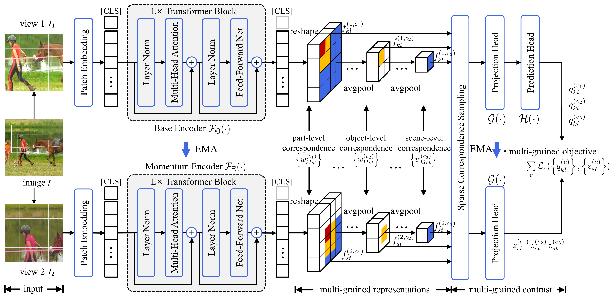

## Multi-Grained Contrast for Data-Efficient Unsupervised Representation Learning

Official implementation and pre-trained models for paper MGC: **"Multi-Grained Contrast for Data-Efficient Unsupervised Representation Learning"**.

<p align="center"> </p>

[[Paper](https://arxiv.org/abs/2407.02014)]    [[BibTex](#Citation)]    [[Blog(CN)]()]

MGC is  a novel multi-grained contrast method  for unsupervised representation learning. MGC constructs delicate multi-grained correspondences between positive views and then conduct multi-grained contrast by the correspondences to learn more general unsupervised representations. Without pretrained on large-scale dataset, MGC significantly outperforms the existing state-of-the-art methods on extensive downstream tasks, including object detection, instance segmentation, scene parsing, semantic segmentation and keypoint detection. 


### Requirements

---

```
conda create -n mgc python=3.8
pip install -r requirements.txt
```

### Datasets

---

MGC is pretrained on COCO 2017, VOC and ADE20K datasets, respectively. The root paths of data are respectively set to `./dataset/coco2017`, `./dataset/voc`and `./dataset/ade20k`. 

### Pre-training

---

To start the MGC pre-training, run MGC pretraining code on COCO for 800 epochs with the following command.

```bash
python main_pretrain.py --arch='vit-small' --dataset='coco2017' --data-root='./dataset/coco2017' --nepoch=800
```

#### Pre-trained Model Weights

All models are trained on ViT-S/16 for 800 epochs. For detection, segmentation and keypoint detection downstream tasks, please check [evaluation/detection](./evaluation/detection), [evaluation/segmentation](./evaluation/segmentation) and [evaluation/pose](./evaluation/pose).

**Note**: 

+ If you don't have an **mircosoft office account**, you can download the trained model weights by [this link](https://csueducn-my.sharepoint.com/:f:/g/personal/221258_csu_edu_cn/EkmM2ut8sE5ChqB6MW9qJCQBAXm2RmKPiRx6MdtMPuuygw).

+ If you have an **mircosoft office account**, you can download the trained model weights by the links in the following tables.

| pretrained | checkpoint |
| :----------------: | :----------------: |
|  COCO2017  | [download](https://csueducn-my.sharepoint.com/:u:/r/personal/221258_csu_edu_cn/Documents/OpenSource/mgc_weights/pretrain/coco/small_800ep_coco.pth) |
|    VOC     | [download](https://csueducn-my.sharepoint.com/:u:/r/personal/221258_csu_edu_cn/Documents/OpenSource/mgc_weights/pretrain/voc/small_800ep_voc.pth) |
|   ADE20K   | [download](https://csueducn-my.sharepoint.com/:u:/r/personal/221258_csu_edu_cn/Documents/OpenSource/mgc_weights/pretrain/ade/small_800ep_ade.pth) |

### Evaluation

Our method are evaluate on the following downstream tasks, including object detection, instance segmentation, semantic segmentation and keypoint detection.

#### 1. Object Detection & Instance Segmentation

step 1. Install mmdetection

```
git clone https://github.com/open-mmlab/mmdetection.git
git checkout v2.26.0
```

step 2.  Fine-tune on the COCO dataset 

```bash
tools/dist_train.sh configs/mgc/mask_rcnn_vit_small_12_p16_1x_coco.py [number of gpu] --seed 0 --work-dir /path/to/saving_dir    --options model.pretrained=/path/to/model_dir
```

step 3.  Fine-tune on the Cityscapes dataset

```bash
tools/dist_train.sh configs/mgc/mask_rcnn_vit_small_12_p16_1x_cityscape.py [number of gpu] --seed 0 --work-dir /path/to/saving_dir    --options model.pretrained=/path/to/model_dir
```

**Model weights finetuned on COCO 2017 and Cityscapes**:

| pretrained |  finetune  |         arch          | bbox mAP | mask mAP |                          checkpoint                          |
| :--------: | :--------: | :-------------------: | :------: | :------: | :----------------------------------------------------------: |
|  COCO2017  | COCO 2017  | ViT-S/16 + Mask R-CNN |   42.0   |   38.0   | [download](/https://csueducn-my.sharepoint.com/:u:/r/personal/221258_csu_edu_cn/Documents/OpenSource/mgc_weights/finetune/mmdetection/pretrain_coco_finetune_coco.pth) |
| COCO 2017  | Cityscapes | ViT-S/16 + Mask R-CNN |   33.2   |   29.4   | [download](https://csueducn-my.sharepoint.com/:u:/r/personal/221258_csu_edu_cn/Documents/OpenSource/mgc_weights/finetune/mmdetection/pretrain_coco_finetune_cityscapes.pth) |

#### 2. Semantic Segmentation

step 1. Install mmsegmentation

```bash
git clone https://github.com/open-mmlab/mmsegmentation.git
git checkout v0.30.0
```

step 2.  Fine-tune on the ADE20K dataset 

```bash
tools/dist_train.sh configs/mgc/vit_small_512_160k_ade20k.py [number of gpu] --seed 0 --work-dir /path/to/saving_dir    --options model.pretrained=/path/to/model_dir
```

step 3.  Fine-tune on the VOC07+12 dataset

```bash
tools/dist_train.sh configs/mgc/mask_rcnn_vit_small_12_p16_1x_voc.py [number of gpu] --seed 0 --work-dir /path/to/saving_dir    --options model.pretrained=/path/to/model_dir
```

**Model weights finetuned on ADE20K and VOC**:

| pretrained | finetune |          arch           | iterations | mIoU |                          checkpoint                          |
| :--------: | :------: | :---------------------: | :--------: | :--: | :----------------------------------------------------------: |
| COCO 2017  |  ADE20K  | ViT-S/16 + Semantic FPN |    40k     | 37.7 | [download](https://csueducn-my.sharepoint.com/:u:/r/personal/221258_csu_edu_cn/Documents/OpenSource/mgc_weights/finetune/mmsegmentation/pretrain_coco_finetune_ade.pth) |
|   ADE20K   |  ADE20K  | ViT-S/16 + Semantic FPN |    40k     | 31.2 | [download](https://csueducn-my.sharepoint.com/:u:/r/personal/221258_csu_edu_cn/Documents/OpenSource/mgc_weights/finetune/mmsegmentation/pretrain_ade_finetune_ade.pth) |
| COCO 2017  |   VOC    | ViT-S/16 + Semantic FPN |    40k     | 64.5 | [download](https://csueducn-my.sharepoint.com/:u:/r/personal/221258_csu_edu_cn/Documents/OpenSource/mgc_weights/finetune/mmsegmentation/pretrain_coco_finetune_voc.pth) |
|    VOC     |   VOC    | ViT-S/16 + Semantic FPN |    40k     | 54.5 | [download](https://csueducn-my.sharepoint.com/:u:/r/personal/221258_csu_edu_cn/Documents/OpenSource/mgc_weights/finetune/mmsegmentation/pretrain_voc_finetune_voc.pth) |

#### 3. Keypoint Detection

step 1. Install mmpose

```bash
git clone https://github.com/open-mmlab/mmpose.git
git checkout v1.2.0
```

step 2.  Fine-tune on the COCO dataset 

```bash
tools/dist_train.sh configs/mgc/td-hm_ViTPose-small_8xb64-210e_coco-256x192.py [number of gpu] --seed 0 --work-dir /path/to/saving_dir    --options model.pretrained=/path/to/model_dir
```

**Model weights finetuned on COCO 2017**:

| pretrained | finetune  |  arch   |  AP  |  AR  |                          checkpoint                          |
| :--------: | :-------: | :-----: | :--: | :--: | :----------------------------------------------------------: |
| COCO 2017  | COCO 2017 | ViTPose | 71.6 | 76.9 | [download](https://csueducn-my.sharepoint.com/:u:/r/personal/221258_csu_edu_cn/Documents/OpenSource/mgc_weights/finetune/mmpose/pretrain_coco_finetune_coco.pth) |

### Acknowledgement

---

This code is built on [mmdetection](https://github.com/open-mmlab/mmdetection),  [mmsegmentation](https://github.com/open-mmlab/mmsegmentation) and [mmpose](https://github.com/open-mmlab/mmpose) libray.

### LICENSE

---

This project is under the CC-BY-NC 4.0 license. See [LICENSE](LICENSE) for details.

### Citation

```bibtex
@article{shen2024multi,
  author  = {Shen, Chengchao and Chen, Jianzhong and Wang, Jianxin},
  title   = {Multi-Grained Contrast for Data-Efficient Unsupervised Representation Learning},
  journal = {arXiv preprint arXiv:2407.02014},
  year    = {2024},
}
```

